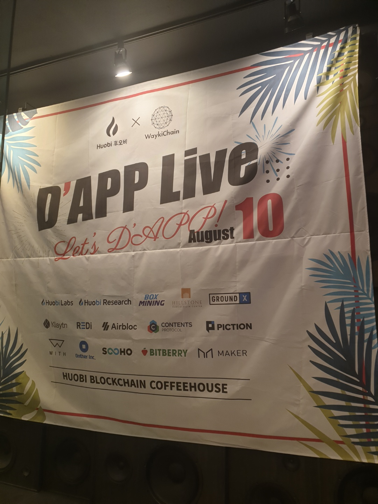
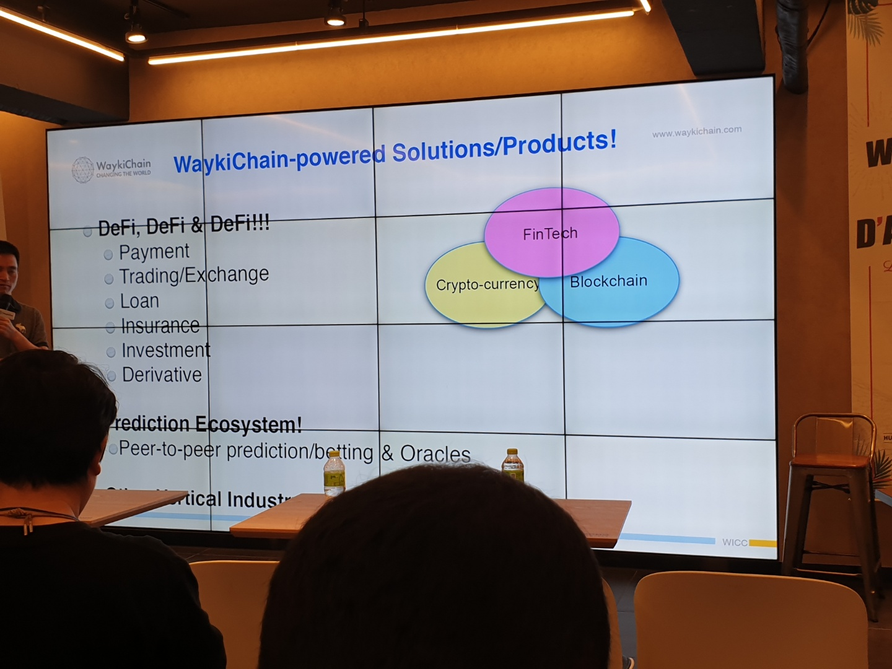
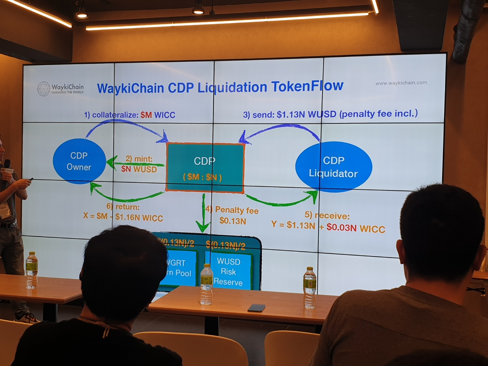
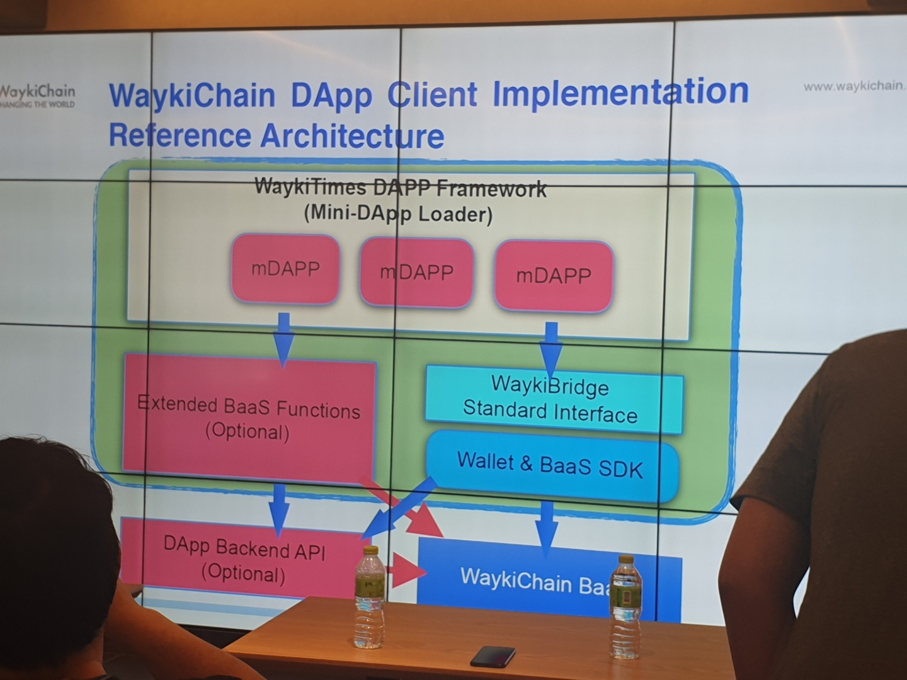
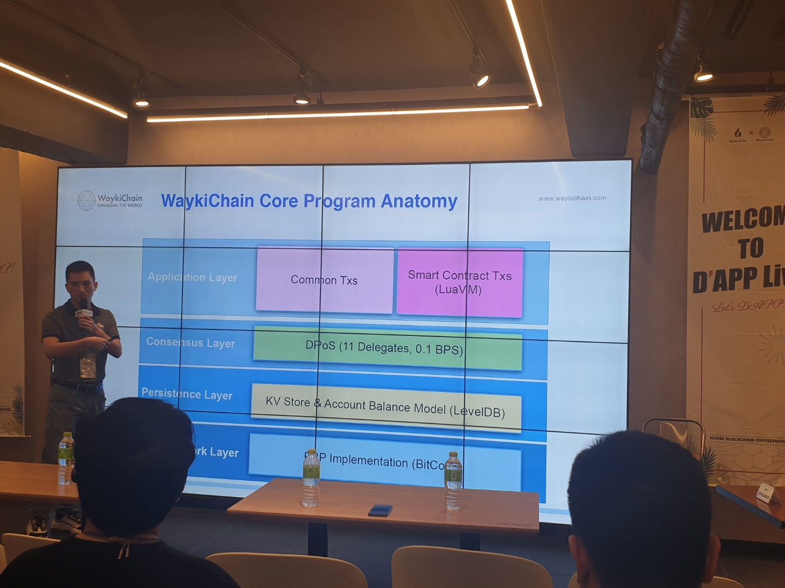

# D'APP Live

링크 - https://www.tokenpost.kr/event/155

## 기술 세미나

### ■ 블록체인 사용 사례
> - 송금 - 수수료 문제로 Paypal은 죽어가고 있다.
> - Education - 학위 및 자격증 등의 정보를 블록체인으로 관리

## 주제 스피치(기술)

### ■ 퍼블릭 블록체인과 프라이버시 by 정순형(Onther Inc)

영지식 증명을 활용한 프라이버시 토크(zk-ERC20) 구현
> - ZKDai Project : 이더림움 기반의 토큰을 private하게 만드는 프로젝트
> - (시크릿) 노트 : 소유자, 액면가
>  -노트를 암호화 해서 블록체인에 기록
> - ZK Proof의 마법
> - Main token이 Layer1(L1), Side token이 Layer2(L2)

### ■ 스마트 컨트랙트 취약점 사례 및 분석 기술 by 박지수(SooHo)

> - The DAO 해킹
> - Reentrancy 취약점
> - Parity Multi-sig Wallet 해킹 
> - Integer Overflow
> - 소프트웨어 검증(Software Verification)

### ■ 블록체인 DApp 기술 트랜드 및 미래

> - DeFi - ex) MakerDAO
> - Volumn : LARGE, User size: SMALL

Crisis

> - Technical Callenge: 코인의 가격이 너무 높아지면서 해킹 위협 증가
> - Incentive Model Imbalance: 인센티브가 너무 높으면 거래량은 높아지겠지만 가격 변동이 심하다. 인센티브가 너무 낮으면 거래 자체가 없을 수 있다.
> - The most serious market size problem: DApp 마켓이 아직 너무 작다.

## 주제 스피치(사용자)

### ■ DAPPs - Greatest Innovation of this Decade

> - 1981 - PC
> - 1989 - 인터넷
> - 2004 - Facebook (SNS)
> - 2007 - 아이폰
> - 2015 - DAAp

장점

> - Nano-Transactions : $0.01 of value
> - Code as 3rd party
> - Voting
> - Tokens that represent permission
> - NFTs (Non-Fundable Tokens)

Focus on what makes DAPPs unique

### ■ Project WITH

무명 운동선수 경력관리

> - 선수가 경기 기록을 올리면 리워드 코인 제공
> - 여려명이 특정 선수의 기록을 올리면서 신뢰성 확보

## 해커톤 발표

40팀 신청, 9팀 본선

### ■ 심사위원 질문

- 다른 체인에 대비 어떤점이 좋았는지?
- 데이팅 앱이 신뢰도 없이도 엄청난 성장을 하고 있는데 과연 기존 기업들이 블록체인을 도입 할까?
- 투명성, 신뢰도도 중요하지만 privacy도 중요하지 않나?
- 잘못 입력한 정보에 대해선 어떻게 할것인지?
- 블록체인으로 했을때의 장점?
- 사용자를 어떻게 유치할것인가? 마케팅 전략은?
- 모든 정보를 다 blockchain에 담을 필요는 없다. (ex. 사용자정보)
- 해당 토큰을 사용하는 이유는?

### ■ DAPPs

- Block World : 블록체인 샌드박스 소셜네트워크 게임
- BoBoCharity : Donation Platform
- Winger : 데이팅 서비스
- WatchDocs : 블록체인 기반 기업 대상 분산 문서 관리 시스템
- ARAM : 개인의 창작물에 대한 저작권 관리
- GameBet : 게임 플랫폼
- Wayki TV : 유투브 스타일 스트리밍 배틀, 사용자 bet, 이긴팀 reward
- 감정평가시스템
- 예측게임

※ MS PPT를 MAC에서 열어 발표하니 문서가 다 깨짐. 주의

※ 발표전 리허설 중요

※ 부족한 점은 발표 마지막 Roadmap 에서 설명

※ 발표가 제일 중요 (발표가 흥미있어야 함)

※ 미리 개발해 가는게 이미지에 안좋을까?

※ PPT에는 완성된 UI, 실제 데모와 달라도 됨

※ 데모시 회원가입이 중요하지 않다면 skip

※ 허황된 roadmap은 필요없다. (투자 받을려는게 아님)

※ 데모가 지루하지 않게