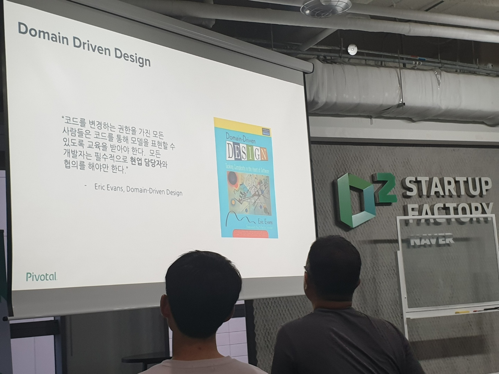
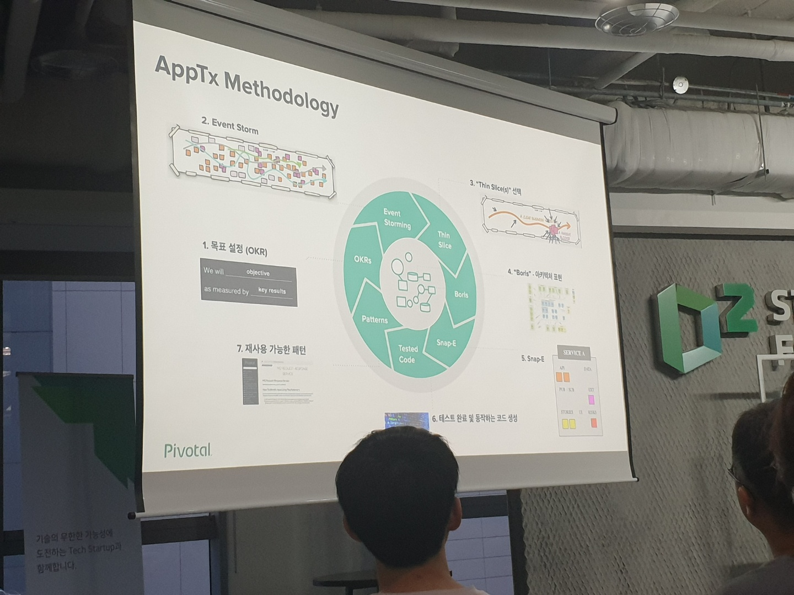
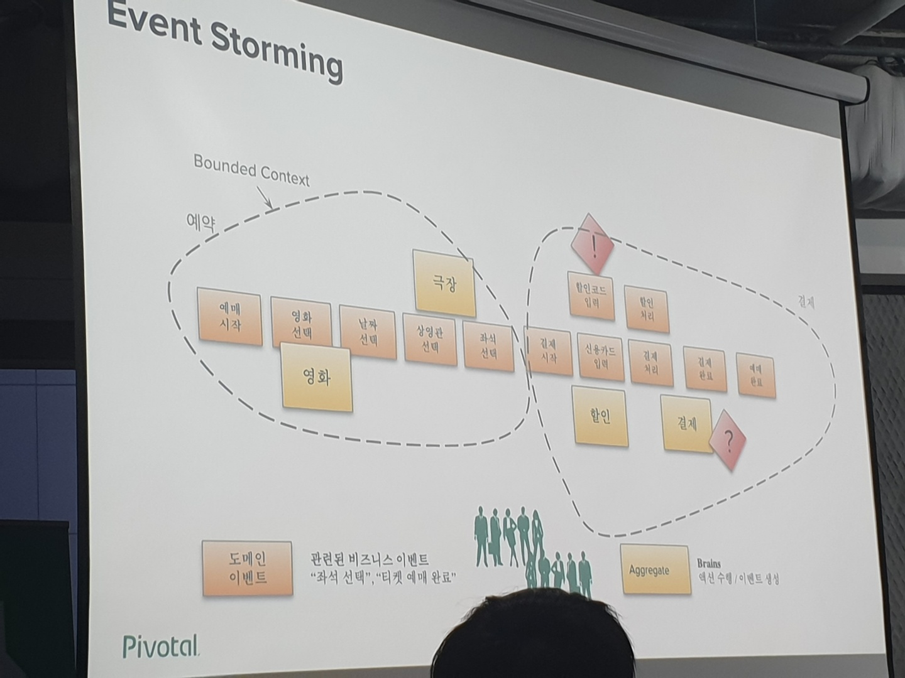
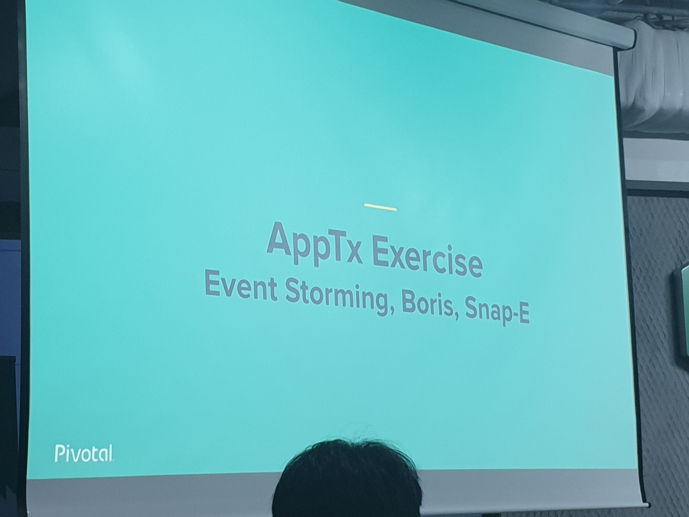
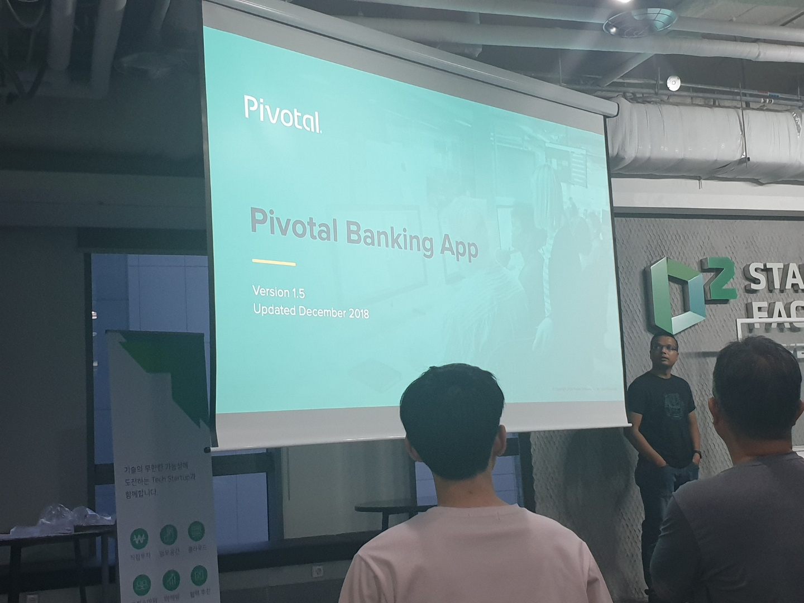
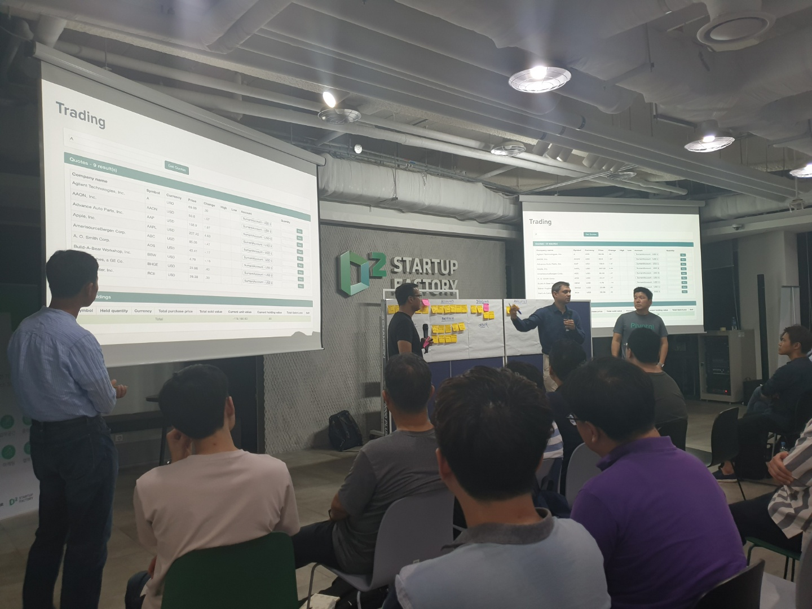
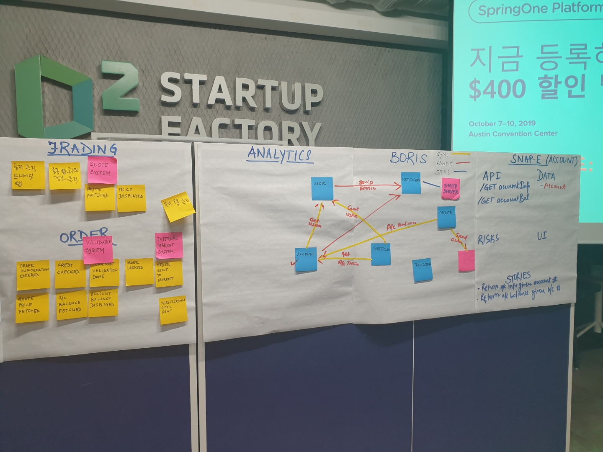

# 마이크로서비스 따라하기 꿀밋업 시리즈

## 2탄 - 도메인 모델에 따른 데이터의 분리 저장과 API 연결

Meetup 링크 - https://www.meetup.com/ko-KR/Seoul-Cloud-Foundry-Meetup/events/263159465/

---

### PIVOTAL

### MSA (Micro Service Architecture)

### DDD (Domain Driven Development)

### Bounded Context
> - BC 당 한 팀이 구성
> - 한 팀이 여러 개의 BC를 관리할 수 있으나 여러 팀이 한개의 BC를 관리하는 것은 매우 어렵다.

### Aggregates
> - 단일 단위로 처리되어야 하는 도메인 객체들의 묶음
> - BC안에 한개 또는 여러개
> - 하나의 트랜젝션에 영향이 가는 단위
> - Micro Service하기 좋은 단위
> - MS 하나당 하나의 Aggregate
> - MS 팀은 2 피자팀 (점심에 피자 두판을 먹을 수 있는 6~8명 정도)
			
			
## How to transfor to MSA

■ Event Storming
> - 이벤트들을 포스트잇으로 붙인다.
> - 화면에서 어떤 어떤 값들을 입력 받는다 등의 디테일한 정보는 적지 않는다.
> - 비즈니스 이벤트는 노랑색, 외부 시스템에서 정보를 가져와야 한다면 빨강색. 가로로 붙인다.
> - 동시에 일어나는 이벤트는 세로로 붙인다.
> - BC를 나누는 기준은 데이터의 오너, 라이프사이클(릴리즈주기), 스케일링 여부
> - BC를 나누면 그것이 서비스 후보고 파랑색으로 붙인다.
	
■ Boris
> - 후보가 있는 서비스들끼리 색깔 줄로 묶는다. 
> - 동기호출, 비동기 호출, 외부 호출을 다른색으로 표시
> - 어떤 데이터를 보내고 받는지도 줄에 붙인다.
	
■ SNAP-E
> - 후보 서비스를 가지고 API, Risk, Data, UI, Story를 적는다.	
> - Snap-e의 목적은 story를 가지고 backlog를 만드는 것이다.

